> This source bundle is **SCVTC Campus Next 0.3.0-alpha**, an unofficial school-specific modification. See [SCVTC_BUILD.md](SCVTC_BUILD.md) for build instructions and the actual implementation status, and [SCVTC-NOTICES.md](SCVTC-NOTICES.md) for provenance and licenses. The upstream documentation below does not imply that all SCVTC services are connected.

<div align="center">


# Zhengfang Academic Assistant

**[简体中文](README.md) · English**

View your timetable, check grades, and manage course enrollment on your phone.

Supports new and legacy Zhengfang and Qiangzhi systems. Reusable Jinzhi and Chengfang protocols are also available; school-specific differences can be handled through configuration or campus plugins.

[](https://github.com/znjhahaha/zhengfang-apk/releases/latest)
[](https://github.com/znjhahaha/zhengfang-apk/releases/latest)
[](https://developer.android.com/compose)
[](LICENSE)

**[Download APK](https://github.com/znjhahaha/zhengfang-apk/releases/latest) · [Plugin store](https://plugins.hidisiwa.xyz) · [Report a problem](https://plugins.hidisiwa.xyz/feedback) · [Changelog](CHANGELOG.md)**

[Screenshots](#screenshots) · [Home screen widgets](#home-screen-widgets) · [Getting started](#getting-started) · [Campus plugins](#campus-plugins) · [Build from source](#build-from-source)

</div>

## Screenshots

These screenshots were captured from the app using demo courses and local test plugins. Click an image to view it at full size. They illustrate the interface; consult the source documentation and the relevant [release](https://github.com/znjhahaha/zhengfang-apk/releases) for current behavior.

<table>
  <tr>
    <th>Your week at a glance</th>
    <th>Your day, in chronological order</th>
    <th>Find plugins for your school</th>
  </tr>
  <tr>
    <td><a href="docs/images/schedule-week.png">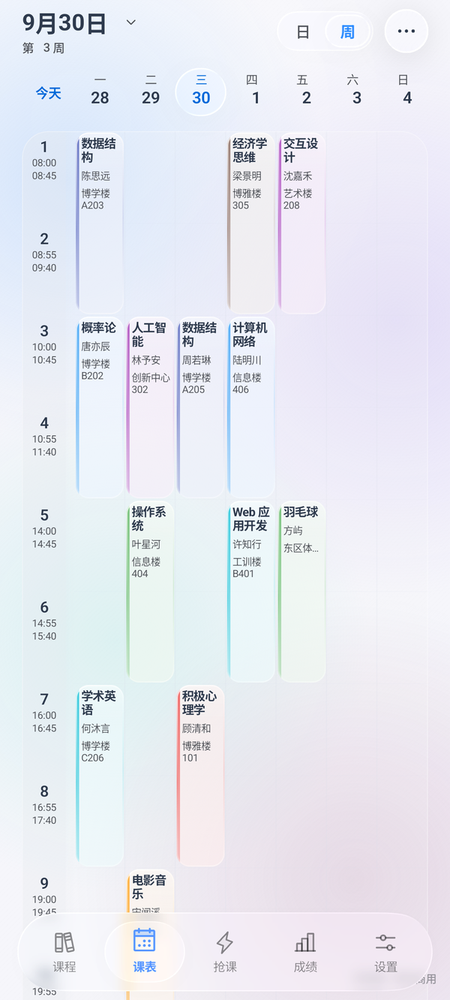</a></td>
    <td><a href="docs/images/schedule-day.png">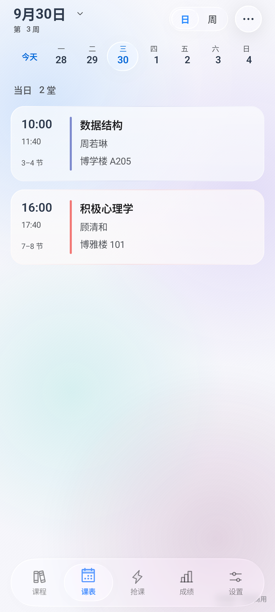</a></td>
    <td><a href="docs/images/plugin-center.png">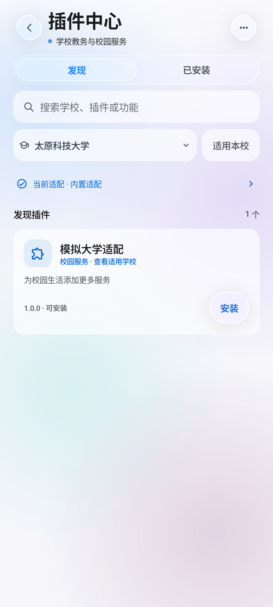</a></td>
  </tr>
</table>

<details>
<summary><strong>Liquid glass interface: navigation, details, settings, and backgrounds</strong></summary>

Translucent cards, floating navigation, and backgrounds share a consistent material, with light and dark themes and custom image backgrounds.

| Floating navigation | Course details | Grouped settings |
| :---: | :---: | :---: |
| 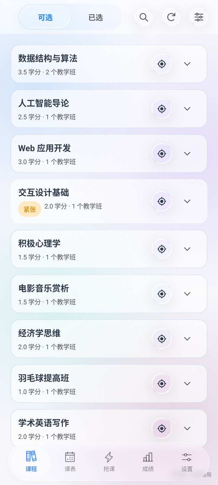 | 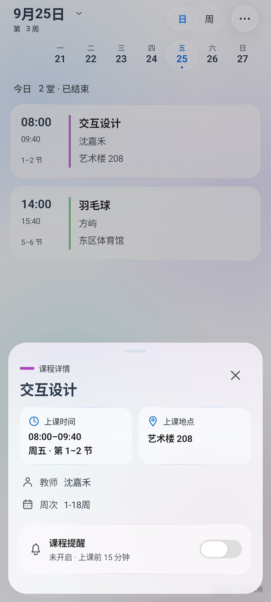 | 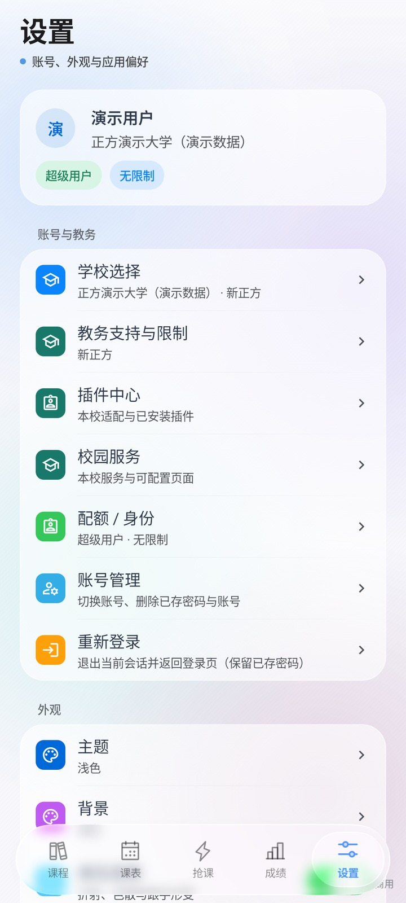 |
| Plugin center | Daily timetable | Background picker |
| 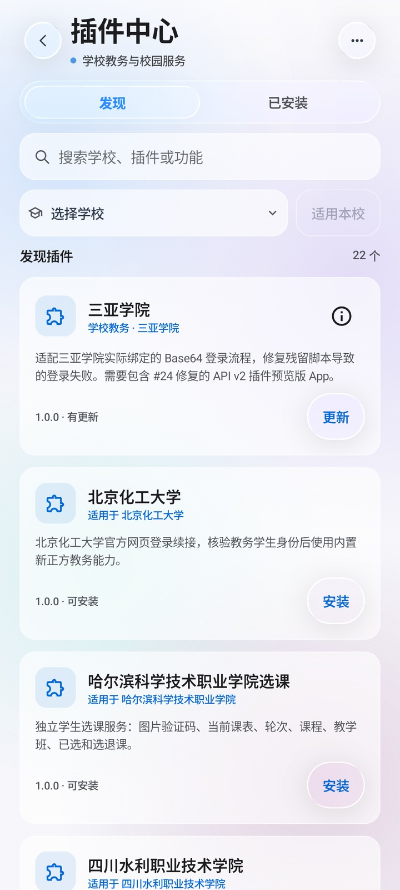 | 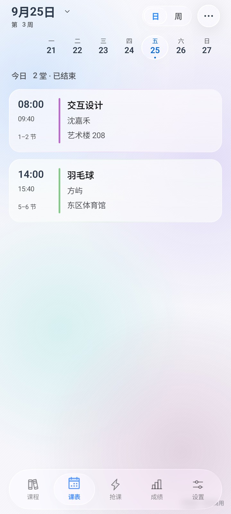 | 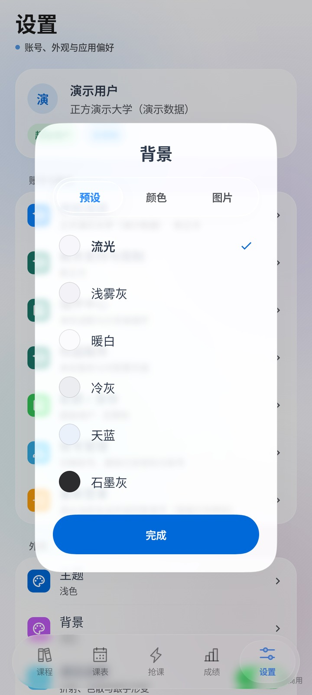 |

These six images were captured on September 25, 2026, in a local MuMu Android 15 emulator running `1.0.87-ui-preview`, using demo data. They document the existing interface and are not acceptance evidence for later features. See the [image provenance notes](docs/images/liquid-glass/README.md).

</details>

- **Open your timetable immediately, then refresh.** Cached courses appear first, followed by a background refresh. Browsing position is preserved when switching pages, dates, and themes.
- **Read full course names.** Week and day views show course and teacher names. Tap a course for details, or long-press to copy information such as its room.
- **Choose how to view your schedule.** Switch between day and week views, show weekends, add custom courses, set reminders, and export to your calendar.
- **Keep dates aligned.** Weekdays and dates share column centers and baselines. Number animations handle single and double digits, month changes, and rapid direction changes.
- **Use light or dark mode.** Customize backgrounds and glass effects. Switches, dates, and page transitions provide continuous animation feedback and respect the system's reduced-motion settings.

A recording of switch interactions and repeated toggling:

<p align="center">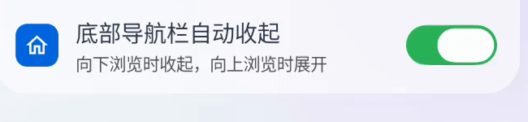</p>

## Home screen widgets

See your next class, teacher, and location without opening the app.

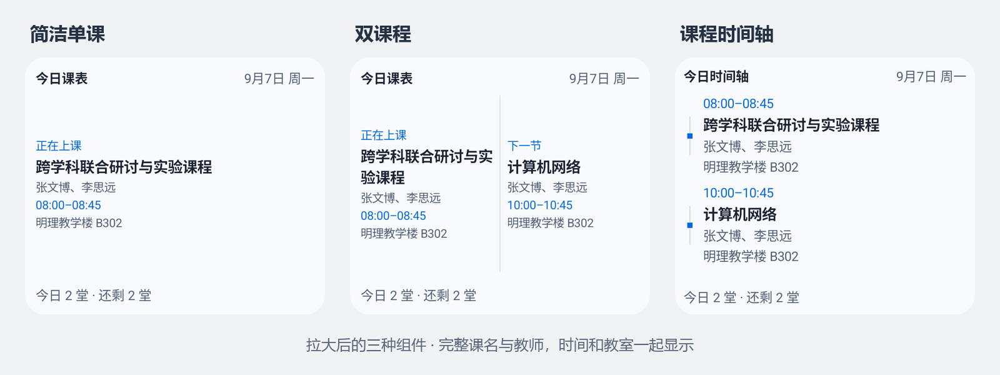

| Widget | When to use it | What it shows |
| --- | --- | --- |
| **Single course · 1×1** | When home screen space is limited | The current or next course, with its full name, teacher, time, and room |
| **Two courses · 2×1** | To see what comes next | Two courses side by side; tap either for details |
| **Course timeline · 2×2** | To see the day's sequence | Courses in time order, highlighting the current and next class; resize to show more |

Preview and add widgets from **Timetable → More → Widgets**, or use your launcher's widget picker. Long-press to resize a widget for more text, end times, and additional courses. Widgets read the current account's local timetable and work offline. Small widgets prioritize space for full course names, teachers, times, and rooms before adjusting text size; they retain full location information rather than reducing it to a room number.

## More features

| Feature | What it offers |
| --- | --- |
| Timetable | Day and week views, course details, date navigation, calendar export, and reminders for an entire selected term |
| Grades and exams | Grades, GPA, and exam schedules by term, using the data supplied by your school |
| Course enrollment | Course search, enrollment and withdrawal, batch queues, scheduled execution, and seat availability checks |
| Campus plugins | School search, academic adapters, native pages, and web services; authorized reuse of school login sessions; version-specific source downloads for contributors |
| Personalization | Light and dark themes, custom backgrounds, and glass effects adapted to device capabilities |
| Messages and feedback | Update notices, announcements, survey reminders, and website feedback without a GitHub account |

Available data and operations depend on the school's system. Enrollment windows, seat limits, conflict rules, and verification challenges remain subject to school requirements. Scheduled tasks and background reminders require the relevant system permissions and background execution conditions.

## Getting started

1. Download the APK from the [latest release](https://github.com/znjhahaha/zhengfang-apk/releases/latest). Requires **Android 7.0 or later**.
2. Search for your school on the login screen, select an adapter, and review its permissions. You can also choose a saved custom school or add and manage schools manually. Complete your school's login process.
3. Open the timetable and sync your courses. Check the term, term start date, and class period times. You can then view grades, manage enrollment, or add widgets.

The app includes an update checker. If your school uses a special login flow or academic API, search for its name in the plugin center.

<details>
<summary><strong>Having trouble with your timetable, widgets, or login?</strong></summary>

- **Incorrect course dates:** Check the selected term, term start date, and teaching weeks. Courses with unclear week information will prompt you to verify it.
- **No courses in a widget:** Log in and sync your timetable first, then check class period times and the term start date. Widgets switch timetables when you switch accounts.
- **Expired login:** Return to the app and sign in again. Complete any verification code or additional confirmation required by your school.
- **Missing reminders:** Check notification permissions, alarm permissions, and background execution settings.
- **Unsupported school:** Check the plugin store, or submit feedback with the system type, academic portal address, and a description of the problem.

</details>

## Campus plugins

The plugin center has **Discover** and **Installed** views. Search by name, filter by school, inspect plugin details, and install or activate adapters. Cached catalog entries appear first and remain available if refreshing fails.

School search combines saved schools with the signature-verified plugin catalog, showing compatibility and available providers. Selecting an adapter downloads and verifies it, requests authorization, and activates it before binding it to the school. If multiple candidates exist, you choose which to use. Existing custom addresses are preserved.

Manage school adapters and installed plugins using domain, port, and path matching. School-specific disable, uninstall, and rollback actions have separate controls. Existing configuration and available cached data remain usable offline.

You can enable plugins from different authors for the same school. When a plugin needs your existing school login, you authorize the host to send requests within a defined scope; the calling plugin does not receive the shared login's raw password or cookies. Choosing **Allow and remember** lets the host reuse your consent after an app restart or a new login to the same account. **This session only** lasts for the current login session. Changes to the account, school, provider identity, authorized scope, or local package digest may require confirmation again. Updates from the same trusted publisher can retain consent when their scope does not expand. Revoke consent in plugin details. Services with independent authentication keep their own accounts. See the [shared login guide](https://plugins.hidisiwa.xyz/wiki/shared-login).

Authors keep the same plugin ID and increase its version when publishing updates. The portal groups version history by plugin. Features have separate searchable labels. Updates that add permissions require confirmation, while running tasks continue using their original package version.

Campus services can use their own `X-Token` authentication. Their manifests must declare an exact network scope and `network.request@3`; the host checks the scope for requests and every redirect. See the [service authentication documentation](https://plugins.hidisiwa.xyz/docs/SERVICE-AUTH.md).

The **Source code and contributions for this version** section in plugin details refers to the installed version. It shows the license, source digest, and repository link when available. Download the source to propose fixes to the current maintainer, or create a derivative under a new plugin ID while preserving attribution and license requirements. Historical versions without public source are labeled accordingly.

**Jinzhi and Chengfang support reusable school configurations.** An adapter can inherit a base protocol and configure its school's academic portal, authentication entry point, and network scope. Jinzhi also requires the school's class period schedule. Extension plugins can supply capabilities where APIs or login flows differ.

The app includes adapters for Hubei University of Automotive Technology (Jinzhi) and Shandong Institute of Petroleum and Chemical Technology (Chengfang), without requiring a separate import. Other schools need their own configuration and compatibility verification. The Chengfang base protocol currently does not support enrollment or withdrawal submissions. See the [six protocol families and migration guide](https://plugins.hidisiwa.xyz/docs/architecture-v3/PROTOCOLS.md) for capabilities and adaptation instructions.

| What you want to do | Where to go |
| --- | --- |
| Find an adapter for your school and check its author and requirements | [Plugin store](https://plugins.hidisiwa.xyz) |
| Develop an academic adapter or campus service | [Developer center: SDK, templates, and API documentation](https://plugins.hidisiwa.xyz/developers) |
| Report a plugin issue and follow its progress | [Feedback portal](https://plugins.hidisiwa.xyz/feedback) |
| Talk with developers | **QQ group: 1074017033** |

New submissions undergo automated checks and human publication review. Catalog signatures verify their origin; signature verification and human review status are displayed separately. Historical versions without review evidence are labeled explicitly. Older plugins remain compatible. Academic adapters match school domains, ports, and paths; conflicts can be resolved manually, with separate school-specific disable, uninstall, and rollback controls.

This repository contains the plugin runtime and protocol files used by the app. SDK generation sources and the plugin website are maintained separately.

Contributions of school adapters and campus services are welcome. **Developer QQ group: 1074017033**. The [developer center](https://plugins.hidisiwa.xyz/developers) provides the SDK, templates, API documentation, and submission entry point. SDK **3.2.8** retains API major version **3**. The website guides authors through **Develop → Validate and package → Submit an update**. Platform sources are maintained in a separate repository; public documentation, reusable agent prompts, and both developer kits are available through the developer center. The [developer wiki](https://plugins.hidisiwa.xyz/wiki/) includes full tutorials and examples of correct and incorrect usage. This repository includes the app runtime and generated contract resources.

## Set reminders for a whole term

In the timetable's **Class reminders** settings, enable or disable reminders for the current account's entire selected term, including custom courses. Existing lead times are preserved; newly enabled reminders default to 15 minutes before class. Courses added afterward start with reminders disabled and can be configured individually.

The page distinguishes enabled reminders from reminders the system can actually schedule. Check notification permissions, exact alarm permissions, and term timing when prompted. Missing times, past events, or system restrictions can prevent scheduling even when a reminder preference has been saved.

## Current source and SDK

`main` includes host capabilities for **SDK 3.2.8 / API 3**. The current stable app is **1.0.103**. Each release retains its own version information. New capabilities are checked through manifest `requires` and `minAppVersionCode` fields; sharing the same API major version alone does not establish client compatibility.

| Developer resource | Purpose |
| --- | --- |
| [Full developer kit](https://plugins.hidisiwa.xyz/downloads/plugin-starter-v3.zip) | CLI, SDK, templates, protocol sources, and offline fixtures |
| [Standalone SDK source archive](https://plugins.hidisiwa.xyz/downloads/plugin-sdk-v3.zip) | Types, contracts, generators, and consumer examples; independently rebuildable |
| [Agent development guide](https://plugins.hidisiwa.xyz/docs/AGENT-QUICKSTART.md) | Find contracts, choose templates, validate, and deliver |
| [Reusable agent prompt](https://plugins.hidisiwa.xyz/docs/AGENT-PROMPT.md) | Generated from the same source as the website's copy button |
| [User guide](https://plugins.hidisiwa.xyz/guide) | Installation, authorization, updates, and source contributions |

## Feedback and privacy

Use the [feedback portal](https://plugins.hidisiwa.xyz/feedback) to submit issues and read replies without a GitHub account. Choosing a public submission also creates a GitHub issue. Feedback entry points are available in app settings, plugin details, and runtime error pages.

Include your **app version, school, reproduction steps, expected behavior, and error message**. Screenshots help with interface issues; redact student IDs and other personal information. Do not publish passwords, verification codes, or session tokens.

Saved login credentials are encrypted locally using Android Keystore and sent to the selected school's academic or authentication endpoint when signing in. Anonymous usage statistics can be disabled in settings and do not include account, school, or course contents.

## Build from source

Requires **JDK 17 or later** and **Android SDK Platform 37.0**. Use the included Gradle Wrapper. Node.js and a separate plugin SDK generation step are not required to build the app.

```sh
git clone https://github.com/znjhahaha/zhengfang-apk.git
cd zhengfang-apk
./gradlew testDebugUnitTest lintDebug assembleDebug
```

On Windows, use `gradlew.bat`. Configure the Android SDK through `ANDROID_HOME` or a local `local.properties` file. The debug APK is written to `app/build/outputs/apk/debug/app-debug.apk`.

Plugin and UI device tests use a separate preview build:

```sh
./gradlew assembleUiPreview assembleUiPreviewAndroidTest -PuiTestBuildType=uiPreview
```

The preview build includes demo data and uses package name `com.tyust.course.uipreview`, allowing it to coexist with the production app. Device regression scripts in [`scripts/`](scripts) accept a device serial number, API level, and ADB path.

<details>
<summary><strong>Repository layout</strong></summary>

```text
app/             Android app, plugin runtime, and tests
docs/images/     Screenshots used in the README
scripts/         Device regression and release helper scripts
release-notes/   Release notes by version
.github/         GitHub Actions build and release configuration
CHANGELOG.md     Changelog
```

</details>

## Contributing

[Issues](https://github.com/znjhahaha/zhengfang-apk/issues) and pull requests are welcome. Prefer plugins for school-specific differences. For app changes, describe the problem, the resulting behavior, and how you verified it. Include screenshots for UI changes.

This project is licensed under [GNU GPL v3](LICENSE). Preserve copyright and license notices, and provide corresponding source code as required when modifying or distributing it.

## Community values

The project embraces the [LINUX DO](https://linux.do/) community's values of sincerity, kindness, solidarity, and professionalism, and supports open-source sharing and technical exchange.
