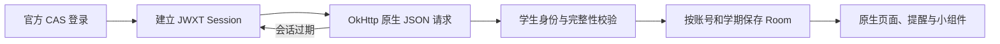

# 构建原理

川职·知学基于 zhengfang-apk 原生工程，保留 Compose 界面、宿主协议、课表编辑、提醒和桌面组件。本校认证与接口位于 `app/src/main/java/cn/scvtc/campus`，页面和同步协调位于 `app/src/main/java/com/tyust/course/scvtc`，学校数据校验位于 `school-core`。应用的常用入口只提供川职服务，宿主底层保留上游接口兼容性。



应用表单将账号密码交给 `CasAuthManager` 的应用级任务。在不展示的 WebView 中加载真实 CAS，等待表单挂载、校验来源和字段，再使用学校自己的提交处理器。CAS、service 回调和 JWXT 各自取得 Cookie，`JwxtCookieJar` 按请求 URL 读取，不能把 CAS Cookie 当作教务 Session。`JwxtSessionManager` 必须调用真实学生身份接口并匹配账号，URL 到达学生主页不算成功。

`OfficialLoginMemory` 只把待核验输入短暂加密保存；真实身份接口通过以后才升级为长期本机凭据。登录由应用级协程执行，页面仅观察状态；同一任务不会因重复点击创建第二次认证。额外验证进入单独的官方页面，普通登录不需要用户操作网页。主动退出取消认证并移除当前账号凭据，切换账号则保留凭据和离线记录。

App 优先恢复本地 Session，失效后尝试 SSO，再必要时使用本机加密凭据重新认证。成功后继续失败的数据读取。重试有边界，网络错误不触发清库。验证码或学校二次认证仍按学校要求完成。

## 已接入的本校接口

以下路径相对于 `https://jwxt.scvtc.edu.cn/jwgr/api/`：

| 数据 | 路径 | 校验 |
| --- | --- | --- |
| 学生身份 | `student/studentInfo/querySelf` | 唯一学生、账号匹配 |
| 当前学期 | `baseInfo/semester/selectCurrentXnXq` | 学期标识、日期有效 |
| 学期列表 | `baseInfo/semester/selectXnXqListTy` | 官方字符串数组 |
| 课表 | `arrange/CourseScheduleAllQuery/studentCourseSchedule` | 周次范围完整、课程可解析 |
| 成绩 | `score/scorequerymanage/studentQuery` | 全部分页、总数稳定、账号匹配 |
| 正考安排 | `exam/studentExamSchedule/queryPositiveExamSchedule` | 完整分页与考试字段 |
| 等级考试结果 | `score/gradeExamScore/studentQuery` | 已验证空结果，有记录时仍需字段校验 |
| 毕业学分要求 | `scheme/majorSchemaCustomize/queryStudentGraduationCredit` | 与成绩所得分开；后者来自成绩的实际所得字段 |

`#/jwxt/js/student/index` 是浏览器 Hash 路由，不作为服务器 API 请求。学校返回登录 HTML、302、身份不匹配、重复分页或缺页时不写成功缓存。官方确认的零条记录与请求失败分别显示。通知、请假等尚未验证模块保留官方入口，不填入假数据。

`ScvtcRuntime` 协调身份、学期、同步与 Room 写入。课表与服务结果按账号及学期隔离；只有完整校验后的新结果才能替换对应缓存。服务 JSON 使用账号/学期/模块关联的 AES-GCM，旧明文记录只兼容读取，成功同步后加密替换。

`Models.kt` 的本校 UI 白名单与 API 能力目录分开：只显示课表、成绩、学分，搜索使用同一白名单。其余业务由 `ScvtcWebActivity` / `ScvtcWebSession` 承载学校官网；WebView 负责 SSO 和真实网页操作，本地数据仍通过原生 HTTP 获取。`scvtc-capture.js` 只观察身份与学期 JSON，并保留官网 `window.open`，不解析 HTML 冒充业务 API。

同步状态由 `NativeSyncState` 驱动，右上角刷新复用协调器；失败不更新成功时间。壁纸采用独立清晰/柔化文件，完成 EXIF、模糊和色调处理后原子激活；旧版壁纸与失败回退兼容。卡片与底栏沿用原版完整 Backdrop、模糊与折射链路；本轮低分辨率卡片替代方案已经撤回。效果参数仍由用户手动选择，不按机型自动降级。

`CampusCompanion` 将五张原创表情以后台解码、2 MiB LRU 保存；生命周期达到 STARTED 且允许动画才切换待机。角色状态、尺寸和显隐沿用既有偏好键。

## 构建

准备 JDK 21、Android SDK Platform 37.0、对应 Build Tools，设置 `JAVA_HOME` 和 `ANDROID_HOME`。

```sh
./gradlew :app:assembleRelease
```

Windows 使用 `gradlew.bat`，内存较小时加 `--max-workers=1`。发布配置和原签名保存在仓库外；覆盖安装要求 applicationId、原证书与 versionCode 符合升级条件。最终检查 APK SHA-256、证书、ZIP 完整性、16 KiB 对齐和源码对应关系。更新元数据签名与 APK 原签名分别验证。编译通过不等于完成真机验收。

赞赏原图由仓库外 `SCVTC_DONATION_PNG` 输入；未配置的公开源码不含私人支付图。图标、角色和提示词见 [BRANDING_20261009.md](BRANDING_20261009.md)。
