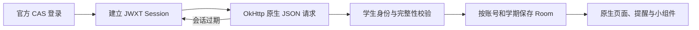

# 构建原理

川职·知学基于 zhengfang-apk 原生工程，保留 Compose 界面、插件平台、课表编辑、提醒和桌面组件。本校适配位于 `app/src/main/java/cn/scvtc/campus`，学校数据校验位于 `school-core`。插件中心的其他学校沿用各自适配器，不代表全部经过本项目实机验证。



`CasAuthManager` 负责官方认证；密码提交仍由官方表单执行。CAS、service 回调和 JWXT 各自取得 Cookie，`JwxtCookieJar` 按请求 URL 读取，不能把 CAS Cookie 当作教务 Session。`JwxtSessionManager` 必须调用真实学生身份接口并匹配账号，URL 到达学生主页不算成功。

App 优先恢复本地 Session，失效后尝试 SSO，再必要时使用本机加密凭据重新认证。成功后继续失败的数据读取。重试有边界，网络错误不触发清库。验证码或学校二次认证仍按学校要求完成。

## 已接入的本校接口

以下路径相对于 `https://jwxt.scvtc.edu.cn/jwgr/api/`：

| 数据 | 路径 | 校验 |
| --- | --- | --- |
| 学生身份 | `student/studentInfo/querySelf` | 唯一学生、账号匹配 |
| 当前学期 | `baseInfo/semester/selectCurrentXnXq` | 学期标识、日期有效 |
| 学期列表 | `baseInfo/semester/selectXnXqListTy` | 官方字符串数组 |
| 课表 | `arrange/CourseScheduleAllQuery/studentCourseSchedule` | 周次范围完整、课程可解析 |
| 成绩 | `score/scorequerymanage/studentQuery` | 全部分页、总数稳定、账号匹配 |
| 正考安排 | `exam/studentExamSchedule/queryPositiveExamSchedule` | 完整分页与考试字段 |
| 等级考试结果 | `score/gradeExamScore/studentQuery` | 已验证空结果，有记录时仍需字段校验 |
| 毕业学分要求 | `scheme/majorSchemaCustomize/queryStudentGraduationCredit` | 只表示毕业要求，不推算已获学分 |

`#/jwxt/js/student/index` 是浏览器 Hash 路由，不作为服务器 API 请求。学校返回登录 HTML、302、身份不匹配、重复分页或缺页时不写成功缓存。官方确认的零条记录与请求失败分别显示。通知、请假等尚未验证模块保留官方入口，不填入假数据。

`ScvtcRuntime` 协调身份、学期、同步与 Room 写入。课表与服务结果按账号及学期隔离；只有完整校验后的新结果才能替换对应缓存。

## 构建

准备 JDK 21、Android SDK Platform 37.0、对应 Build Tools，设置 `JAVA_HOME` 和 `ANDROID_HOME`。

```sh
./gradlew :school-core:test :school-parser:test :app:assembleRelease
```

Windows 使用 `gradlew.bat`，内存较小时加 `--max-workers=1`。发布配置和原签名保存在仓库外；覆盖安装要求 applicationId、原证书与 versionCode 符合升级条件。最终检查 APK SHA-256、证书、ZIP 完整性、16 KiB 对齐和源码对应关系。更新元数据签名与 APK 原签名分别验证。编译通过不等于完成真机验收。
